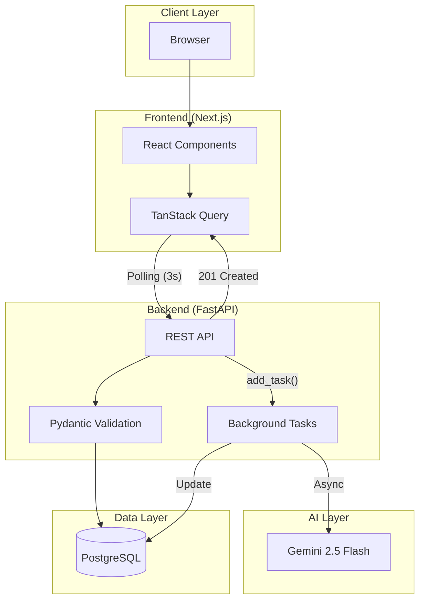
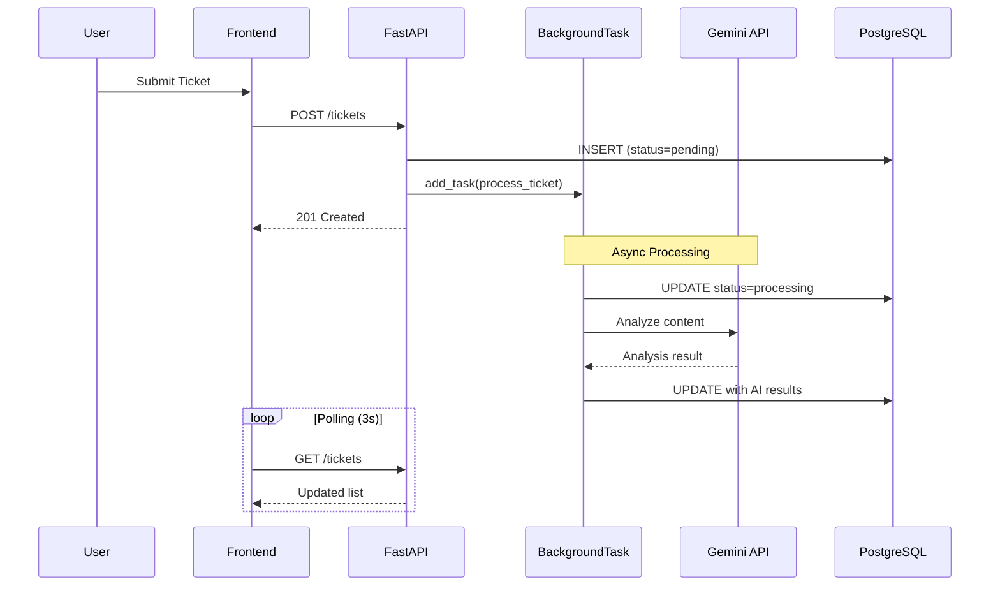
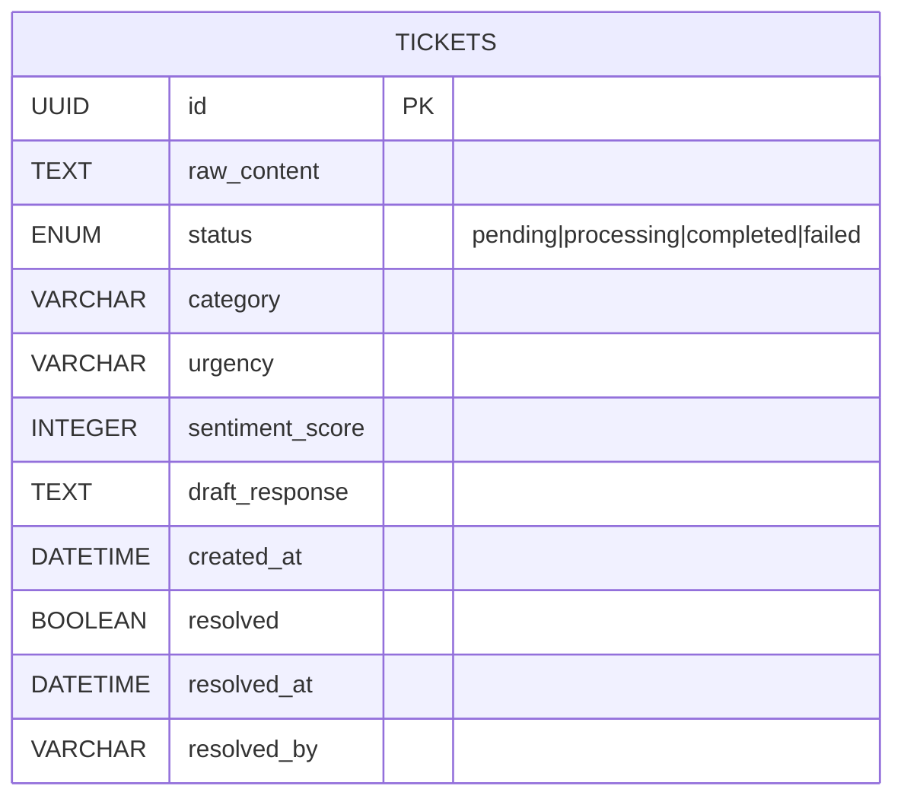
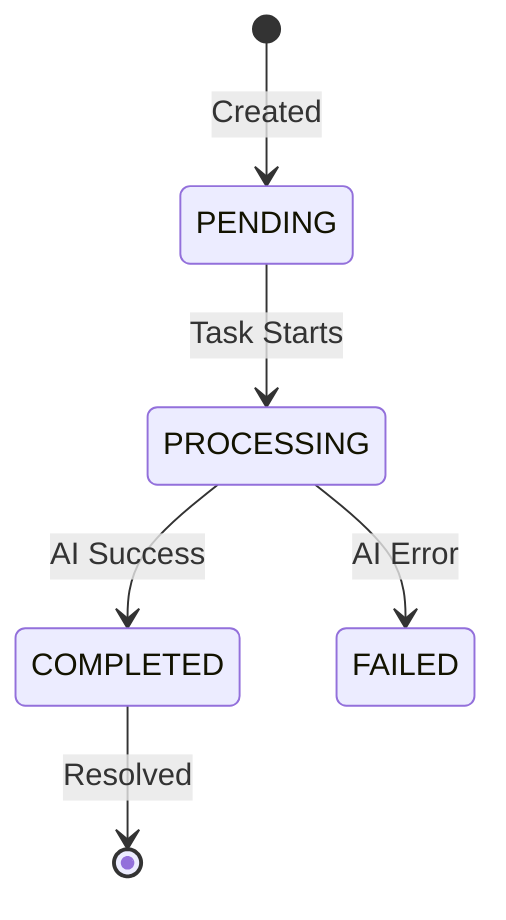

# AI Support Triage Hub

A production-ready monorepo for managing support tickets with AI-powered triage and categorization.

## System Architecture



## Tech Stack

| Layer | Technology | Purpose |
|-------|------------|---------|
| Frontend | Next.js 16, TailwindCSS | App Router, Styling |
| State | TanStack Query | Server state + polling |
| API | FastAPI | Async REST endpoints |
| Validation | Pydantic | Request/Response schemas |
| ORM | SQLAlchemy (Async) | Database abstraction |
| Database | PostgreSQL 15 | Persistent storage |
| AI | Gemini 2.5 Flash | Ticket analysis |
| Container | Docker Compose | Multi-service orchestration |

## Project Structure

```
TriageRecoveryHub/
├── backend/                 # FastAPI backend
│   ├── app/
│   │   ├── main.py         # API Routes
│   │   ├── models.py       # SQLAlchemy ORM
│   │   ├── schemas.py      # Pydantic Models
│   │   ├── database.py     # Async Session
│   │   └── services.py     # AI Processing
│   ├── Dockerfile
│   └── requirements.txt
├── frontend/               # Next.js frontend
│   ├── components/
│   │   ├── TicketForm.tsx
│   │   └── TicketList.tsx
│   └── app/page.tsx
└── docker-compose.yml
```

## Features

- **Non-blocking Architecture**: POST /tickets returns 201 immediately
- **Async AI Processing**: Gemini 2.5 Flash analyzes tickets in background
- **Intelligent Categorization**: Technical, Billing, Account, General
- **Urgency Detection**: Low, Medium, High, Critical
- **Sentiment Analysis**: 1-10 scale scoring
- **Draft Responses**: AI-generated professional responses
- **Real-time Updates**: Frontend polls for status changes
- **Error Resilience**: Fallback handling when AI fails

## Request/Response Flow



## Database Schema



## Getting Started

### Prerequisites

- Docker and Docker Compose
- Gemini API Key ([Get one here](https://makersuite.google.com/app/apikey))

### Quick Start

```bash
# 1. Clone and navigate
cd TriageRecoveryHub

# 2. Set your Gemini API key
echo "GEMINI_API_KEY=your-key-here" > .env

# 3. Start all services
docker compose up --build

# 4. Access the app
# Frontend: http://localhost:3000
# API Docs: http://localhost:8000/docs
```

### Local Development

**Backend:**
```bash
cd backend
python -m venv venv && source venv/bin/activate
pip install -r requirements.txt
uvicorn app.main:app --reload
```

**Frontend:**
```bash
cd frontend
npm install && npm run dev
```

## API Endpoints

| Method | Endpoint | Description |
|--------|----------|-------------|
| POST | `/tickets` | Create ticket + trigger AI |
| GET | `/tickets` | List all tickets |
| GET | `/tickets/{id}` | Get ticket details |
| PATCH | `/tickets/{id}` | Update draft/category |
| POST | `/tickets/{id}/resolve` | Mark as resolved |

### Example Request

```bash
curl -X POST http://localhost:8000/tickets \
  -H "Content-Type: application/json" \
  -d '{"raw_content": "My app crashes when uploading files"}'
```

## Environment Variables

| Variable | Description |
|----------|-------------|
| `GEMINI_API_KEY` | Google Gemini API key |
| `DATABASE_URL` | PostgreSQL connection string |

## Status State Machine



## License

MIT
